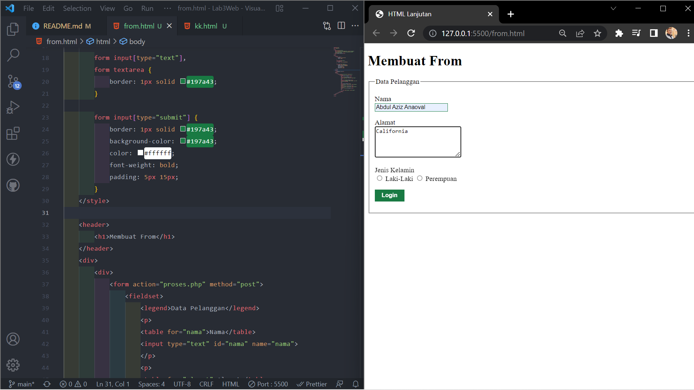

# <b>Langkah-Langkah Praktikum 3 <hr>
|Abdul Aziz Anaoval|
|-------|
|312010049|
|TI.20.A.1|
## 1. Membuat dokumen HTML dengan nama file lab 3 list HTML

```html
<!DOCTYPE html>
<html lang="en">
  <head>
    <meta charset="UTF-8" />
    <meta http-equiv="X-UA-Compatible" content="IE=edge" />
    <meta name="viewport" content="width=device-width, initial-scale=1.0" />
    <title>HTML Lanjutan</title>
  </head>
  <body>
    <header>
      <h1>Membuat List</h1>
    </header>
  </body>
</html>
```

<p>
 Kemudian tambahkan kode untuk membuat Ordered List seperti berikut.

```html
<body>
  <section id="order-list">
    <h2>Ordered List</h2>
    <ol>
      <li>Pemrograman Web</li>
      <li>Sistem Informasi</li>
      <li>Basis Data 2</li>
    </ol>
  </section>
</body>
```

Seperti ini perubahannya

  <br>


## 2. Membuat Unorderd List

<p>Kemudian tambakan kode untuk membuat <i>Unordered List</i> , setelah deklarasi ordered list pada 
section <b> unordered-list</b>, seperti berikut. <p>

```html
<section id="unorder-list">
  <h2>Unordered List</h2>
  <ul type="square">
    <li>Jaringan Komputer</li>
    <li>Struktur Data</li>
    <li>Algoritma &amp; Pemrograman</li>
  </ul>
</section>
```


<br>

## 3. Membuat Description List

<p>
Kemudian tambahkan kode untuk membuat description list setelah deklarasi unorderd-list
<br>

```html
<section id="unorder-list">
  <h2>Description List</h2>
  <dl>
    <dt>Fakultas Teknik</dt>
    <dd>Teknik Industri</dd>
    <dd>Teknik Informatika</dd>
    <dd>Teknik Lingkungan</dd>
    <dt>Fakultas Ekonomi dan Bisnis</dt>
    <dd>Akuntansi</dd>
    <dd>Manajemen</dd>
    <dd>Bisnis Digital</dd>
  </dl>
</section>
```


 Selanjutnya lakukan eksperimen lain terkait list dan penggunaan atribut type pada list.

## 4. Membuat tabel

Buat file baru dengan nama lab3_tabel.html seperti berikut

```html
<!DOCTYPE html>
<html lang="en">
  <head>
    <meta charset="UTF-8" />
    <meta http-equiv="X-UA-Compatible" content="IE=edge" />
    <meta name="viewport" content="width=device-width, initial-scale=1.0" />
    <title>HTML Lanjutan</title>
  </head>

  <body>
    <header>
      <h1>Membuat Tabel</h1>
    </header>
  </body>
</html>
```

Kemudian selanjutnya tambahkan kode untuk membuat tabel sederhana seperti berikut:

```html
<body>
  <header>
    <h1>Membuat Tabel</h1>
  </header>
  <table border="1" cellpadding="4" cellspacing="0">
    <thead>
      <tr>
        <th>No.</th>
        <th>Fakultas</th>
        <th>Program Studi</th>
      </tr>
    </thead>
    <tbody>
      <tr>
        <td>1.</td>
        <td>Teknik</td>
        <td>Teknik Informatika</td>
      </tr>
      <tr>
        <td>2.</td>
        <td>Teknik</td>
        <td>Teknik Industri</td>
      </tr>
      <tr>
        <td>3.</td>
        <td>Teknik</td>
        <td>Teknik Lingkungan</td>
      </tr>
    </tbody>
  </table>
</body>
```


## 5. Mengatur Margin & Padding

<p>

Untuk mengatur margin dan padding pada cel data, tambahkan atribut <i> <b> cellpadding dan cellspacing </b> </i> pada tag table.

```html
<table border="1" cellpadding="4" cellspacing="0"></table>
```

## 6. Menggabungkan Sel Data

<p>
Untuk menggabungkan sel data, gunakan atribut rowspan dan colspan. Atribut rowspan untuk 
menggabungkan baris (secara vertikal) dan colspan untuk menggabungkan kolom (secara 
horizontal). <br>

```html
<table border="1" cellpadding="6" cellspacing="0">
  <thead>
    <tr>
      <th>No.</th>
      <th>Fakultas</th>
      <th>Program Studi</th>
    </tr>
  </thead>
  <tbody>
    <tr>
      <td>1.</td>
      <td rowspan="3">Teknik</td>
      <td>Teknik Informatika</td>
    </tr>
    <tr>
      <td>2.</td>
      <td>Teknik Industri</td>
    </tr>
    <tr>
      <td>3.</td>
      <td>Teknik Lingkungan</td>
    </tr>
  </tbody>
</table>
```


## 6. Membuat From

Buat file baru dengan nama lab3_form.html seperti berikut.

```html
<!DOCTYPE html>
<html lang="en">
  <head>
    <meta charset="UTF-8" />
    <meta http-equiv="X-UA-Compatible" content="IE=edge" />
    <meta name="viewport" content="width=device-width, initial-scale=1.0" />
    <title>HTML lanjutan</title>
  </head>
  <body>
    <header>
      <h1>Membuat From</h1>
    </header>
  </body>
</html>
```

Kemudian selanjutnya tambahkan kode untuk membuat tabel sederhana seperti berikut:

```html
<div>
            <form action="proses.php" method="post">
            <fieldset>
                <legend>Data Pelanggan</legend>
                <p>
                    <table for="nama">Nama</table>
                    <input type="text" id="nama" name="nama">
                </p>
                <p>
                    <table for="alamat">Alamat</table>
                    <textarea id="alamat" name="Alamat" cols="20" rows="3"></textarea>
                </p>
                <p>
                    <table>Jenis Kelamin</table>
                    <input id="jk_l" type="radio" name="kelamin" value="L">
                    <label for="jk_l">Laki-Laki</label>
                    <input id="jk_p" type="radio" name="kelamin" value="P">
                    <label for="jk_p">Perempuan</label>
                </p>
                <p>
                     <input type="submit" value="Login">
                </p>
            </fieldset>
            </form>
        </div>
```


## 7. Menabahkan Style pada Form

Agar tampilan form lebih menarik, bisa ditambahkan CSS seperti berikut. <br>

```html
<style>
  form p > label {
    display: inline-block;
    width: 100px;
  }

  form input[type="text"],
  form textarea {
    border: 1px solid #197a43;
  }

  form input[type="submit"] {
    border: 1px solid #197a43;
    background-color: #197a43;
    color: #ffffff;
    font-weight: bold;
    padding: 5px 15px;
  }
</style>
```


## Pertanyaan Tugas
<hr>

## 1. Buatlah form yang menampilkan dropdown menu dan listbox dengan multiple selection.

*HTML*

*CSS*


#  *SEKIAN*